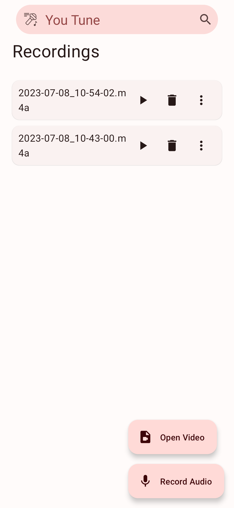
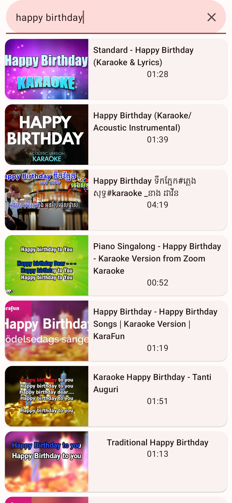
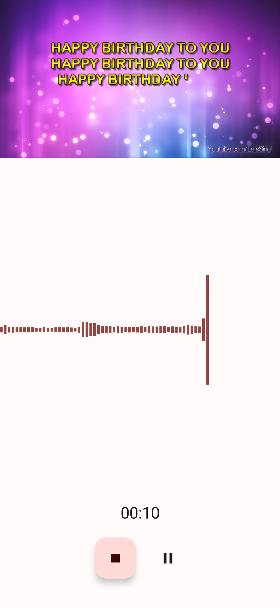

<!-- ---------- Header ---------- -->

  
  <h1>You-Tune</h1>

<a href="https://m3.material.io/">Material Design 3 (You)</a> karaoke song recorder app

<!-- ---------- Badges ---------- -->
  

    
    
    
    
    
     

---

  
  Screenshots

  
  
  

<!-- ---------- Description ---------- -->
## Features

- [x] Open Karaoke video from storage
- [x] Load karaoke video from YouTube
- [x] Realtime audio visualizer
- [x] Material Design 3 (You)
- [x] Dark and light theme

<!-- ---------- Download ---------- -->
## Download

